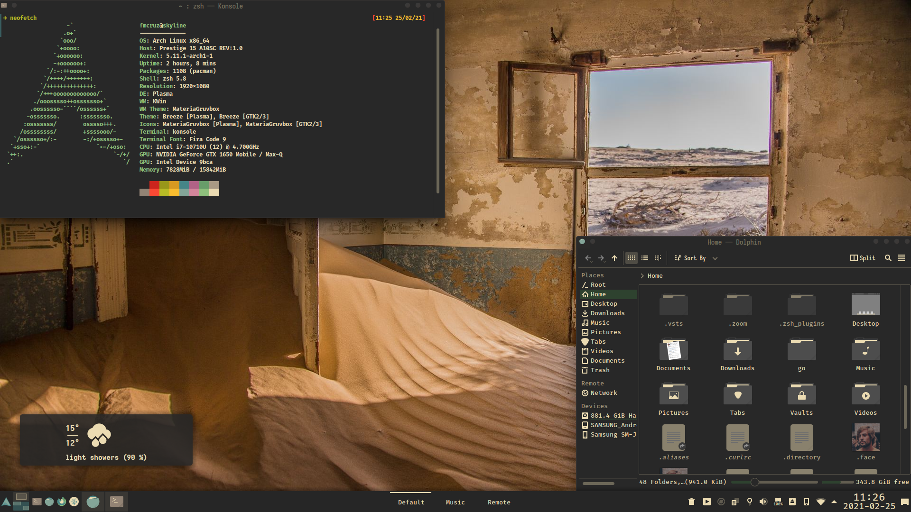
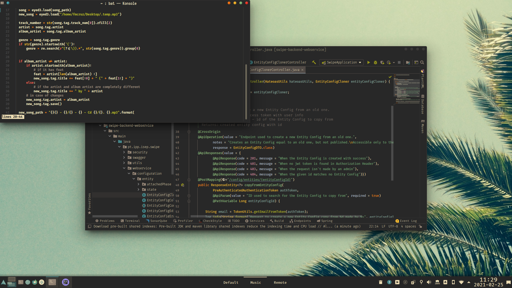
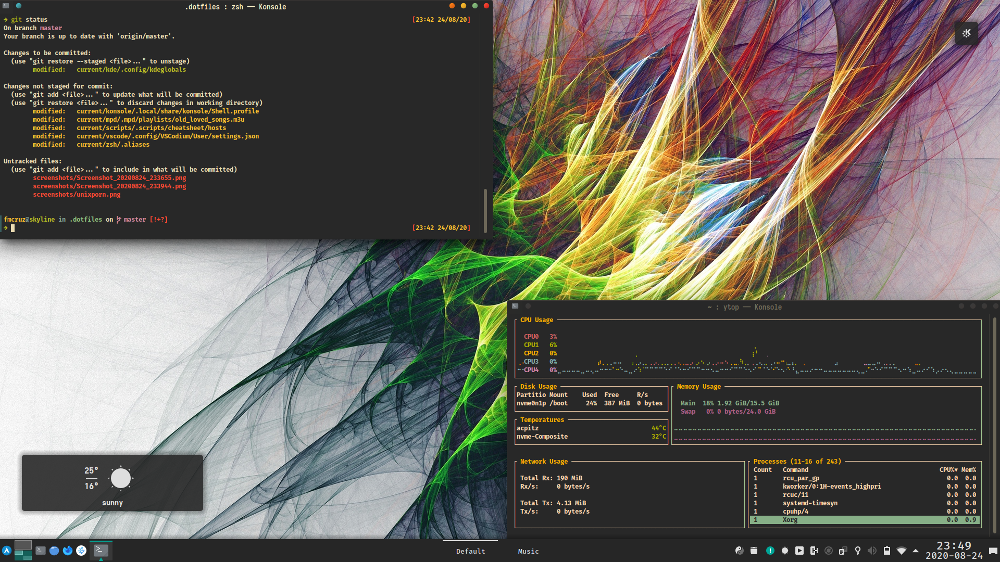
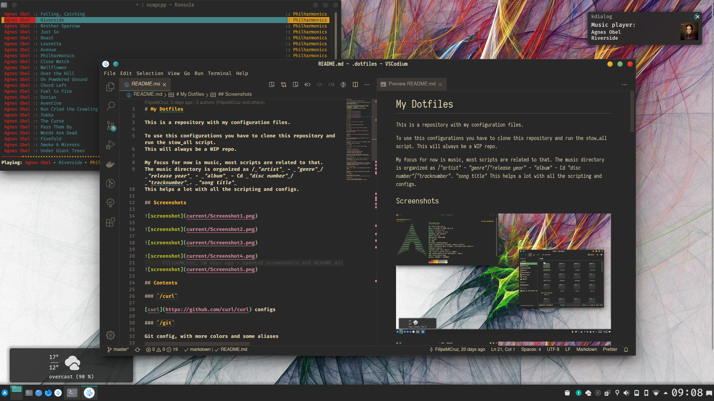
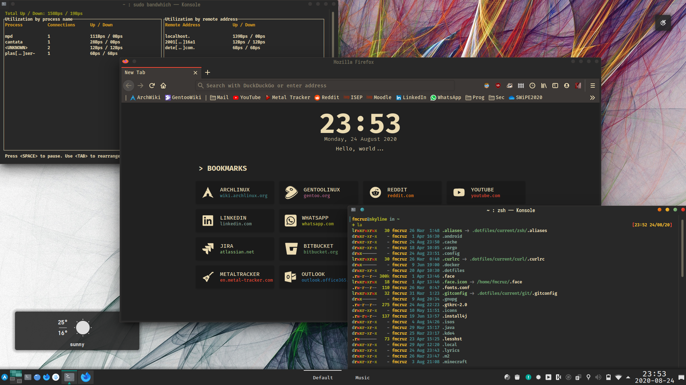
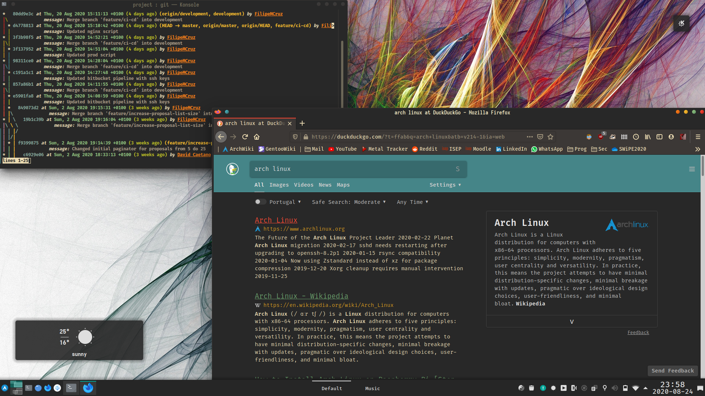
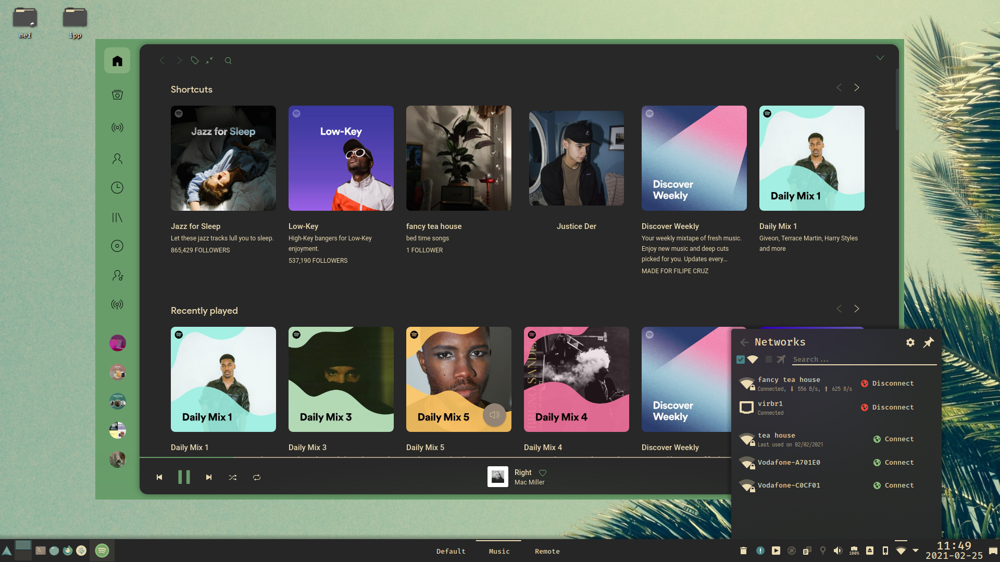

# My Dotfiles

This is a repository with my configuration files.
This will always be a WIP repo.

To use this configurations you have to clone this repository, setup the [needed software](#setup) and run the `stow_all` script.
If there's any module that you don't want simply delete it before running the [stow_all](current/scripts/.scripts/stow_all) script.

My focus for now is music, most scripts are related to that.
The music directory is organized as "/`artist` - `genre`/`release year` - `album` - Cd `disc number`/`track number`. `song title`".
This helps a lot with all the scripting and configs.

## Screenshots

## Setup

I've recently installed these dotfiles in a new machine and faced some turbulence. So I'll try to provide a more complete walkthrough of the installation process.

Needed software (most of these are provided by your package manager):

- [Zsh](https://www.zsh.org/);
- [Spaceship Prompt](https://github.com/spaceship-prompt/spaceship-prompt);
- [stow](https://www.gnu.org/software/stow/);
- [bat](https://github.com/sharkdp/bat);
- [mpd](https://github.com/MusicPlayerDaemon/MPD): this is optional;
- [mpc](https://github.com/MusicPlayerDaemon/mpc): this is optional;
- [exa](https://github.com/ogham/exa): this is optional, if you don't want it go to `.aliases` and remove all lines that mention it;
- [paru](https://github.com/Morganamilo/paru): this is optional, if you don't want it go to `.aliases` and remove all lines that mention it.

After installing everything open Konsole Configuration Window and set the default shell to `zsh`.

Some stuff has to be manually configured such as:

- all kde widgets;
- vscode extensions;
- spotify appearance (via [spicetify](https://github.com/spicetify/spicetify-cli) and custom rules to remove the window borders);
- duckduckgo theme;
- intelij theme.

You may also need to manually choose the kde global theme, `MaterialGruvbox`, and enforce the use of the themes color scheme in the `Colors` settings page (select "From current color scheme).

## Modules

### `/bat`

[bat](https://github.com/sharkdp/bat) gruvbox theme

### `/curl`

[curl](https://github.com/curl/curl) config

### `/git`

Git config, with more colors and some aliases

### `/glava`

[glava](https://github.com/wacossusca34/glava) configs

### `/icons`

Icon theme, fork of [tela-icon-theme](https://github.com/vinceliuice/Tela-icon-theme).
Changed the colors of some icons to match my gruvbox theme, added some missing icons

### `/kde`

KDE global configs

### `/kde-shortcuts`

Current shortcuts I use

Needs to be manually added for some reason I'm still trying to understand.

### `/konsole`

[konsole](https://github.com/KDE/konsole) configs, such as profile and colorscheme

### `/mpd`

[mpd](https://github.com/MusicPlayerDaemon/MPD) configs and playlists

### `/nano`

Most of the syntax highlighters were "stollen" from <https://github.com/scopatz/nanorc>

### `/navi`

[navi](https://github.com/denisidoro/navi) cheatsheets i created for navi
I'll add a lot more once i have the time.

### `/ncmpcpp`

[ncmpcpp](https://github.com/arybczak/ncmpcpp) configs

### `/plasma-color-scheme`

Plasma color scheme based on gruvbox dark

### `/plasma-look-and-feel`

[splash screen](https://store.kde.org/p/1304256)

### `/plasma-theme`

Basic theme with icons taken from [here](https://store.kde.org/p/1309269)

### `/plasma-windows-decorations`

Basic decorations for windows, based heavily on [adhe' gruvbox theme](https://store.kde.org/p/1327723)

### `/scripts`

I heavily rely on programs like: [fd](https://github.com/sharkdp/fd), [rg](https://github.com/BurntSushi/ripgrep), [xsv](https://github.com/BurntSushi/xsv) and [fzf](https://github.com/junegunn/fzf).

If you don't know them, check their repos. They are, in my opinion, a must for anyone that spends a lot of time on the cli.

#### `/scripts/.toys`

Nice prints taken from [r/unixporn](https://www.reddit.com/r/unixporn/)!
_Can't remember where i found them, tell me if you know_

#### `/scripts/.cheatsheet`

Some ideas, trash, reminders, my current [hosts table](https://raw.githubusercontent.com/LukeSmithxyz/etc/master/ips) table, and a cheatsheet i found [here](https://gist.github.com/kdev33/d501d5726a6dcc0d1a51879941ec7cd4).

#### `/scripts/.batman`

The only script i had when i was using windows. Used to "hide" a folder.

### `/startpage`

Minimal start page i've made, inspired by [this project](https://github.com/TB-96/Evening-Startpage)

### `/vscode`

Configs related to Vscode extensions.

### `/wallpaper`

Wallpapers i'm currently using

### `/zathura`

Black and White theme

### `/zsh`

Configs related to zsh, plugins, keybindings, theme, variables, and aliases.

## Contributing

Feel free to clone and check my dotfiles.
I'm here to help with problems related to this configs, just drop an issue!

These dotfiles were only tested on Archlinux and Archlinux based distributions. I'm unaware if they work as expected on other distributions like debian, gentoo or void.
